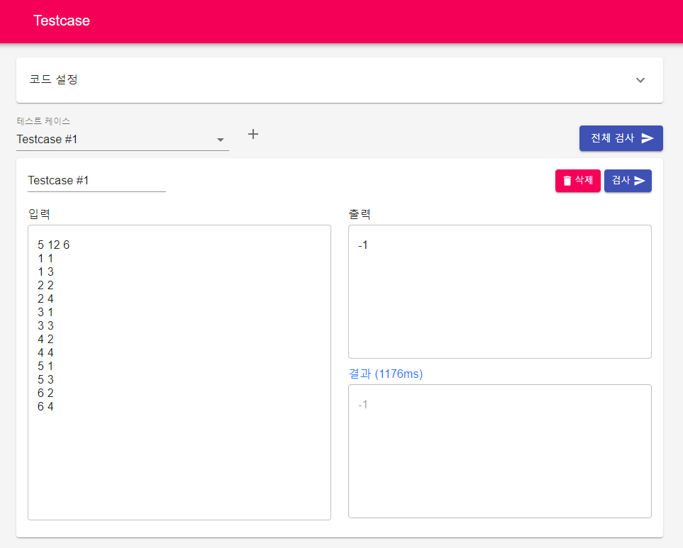

# testcase

테스트케이스 자동 검증

## About the project

본 프로젝트는 프로그래밍 과제의 오류 검증을 효율적으로 할 수 있도록 도와줍니다.

코드, 입력, 출력을 받아 예상한 결과가 나타나는지 검증해줍니다.

## Scripts

실행 가능한 스크립트 목록:

### `npm run build`

실 사용 배포를 위해 사용합니다.

`build` 디렉토리에 빌드된 파일이 저장됩니다.

### `npm run start`
개발을 위해 (특히 프론트엔드) 사용합니다.

[http://localhost:3000](http://localhost:3000)를 통해 실시간으로 코드가 반영되는 개발 모드로 실행됩니다.

api는 php로 되어있기 때문에 이 모드를 이용해 실행할 경우 php를 실행할 수 있는 별도의 환경이 필요합니다.

## Getting started

Windows 환경에서 개발/테스트되었습니다.

### Prerequisites
* php7

api 요청을 위해 사용합니다.

* gcc (path 설정 필요)

c/c++ 컴파일을 위해 사용합니다.

* python3

python 환경에서 테스트케이스 검증을 위해 사용합니다.

* pypy3

pypy 환경에서 테스트케이스 검증을 위해 사용합니다.

* node

node.js 환경에서 테스트케이스 검증을 위해 사용합니다.

### Installation
1. clone the repository
2. `npm install`
3. `/public/api`에 `src` 디렉토리 생성 (사용자가 입력한 코드가 저장될 경로)
unix 계열일 경우 `permission 707` 설정
3. `npm run build`
4. 생성된 `build` 디렉토리를 사용중인 웹서버의 루트로 지정